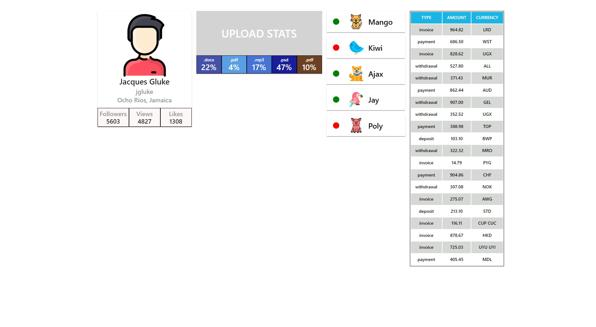

# React components

#### 1. Social network profile

#### The Profile component has been created, with the help of which we display information about social network users. User data is stored in the user.json file.

#### 2. Statistics section

#### A Statistics component has been created that displays statistics on transmitted props. For example, uploading to the cloud by file type, visiting a web page users from different countries, financial expenses, etc. Statistics data lie in the data.json file.

#### 3. List of friends

#### Created a FriendList component that displays information about friend users. Friend's information is stored in the friends.json file.

#### 4. Transaction history

#### A transaction history component has been created in the personal account of Internet Bank. Data for lists are available in JSON format in the transactions.json file. This is an array of objects.

